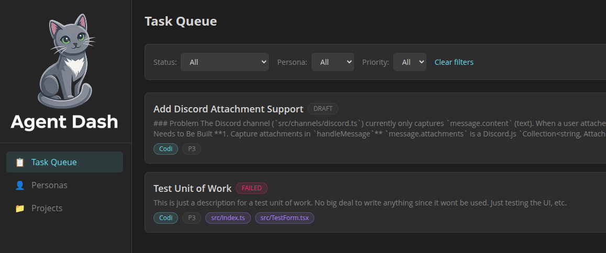

<p align="center">
  
</p>

A self-hosted, planning-first AI kanban board for managing coding tasks across local repos. Submit a task, let an AI planner generate a spec, review and iterate on it, then approve it for coding — all from the dashboard or CLI.

## How it works

1. **Register a project** — point the dashboard at a local repo
2. **Create a task** — describe the work, assign a Planning Persona + Coding Persona
3. **Start Planning** — the AI generates BRIEF.md + ROADMAP.md + phase plans in `.planning/`
4. **Review the plan** — read BRIEF.md and ROADMAP.md directly in the dashboard; iterate with feedback if needed
5. **Mark Ready to Code** — the coding queue picks it up automatically
6. **Review the diff** — once the coding session completes, review the diff and approve or reject

## Prerequisites

- **Node.js** v22+ (nvm recommended)
- **pnpm** — `npm install -g pnpm`
- **Pi SDK skills** installed at `~/.agents/skills/`:
  - `start-work-begin`
  - `start-work-plan`
  - `start-work-run`

## Provider Configuration (API Keys)

Dash AI uses the **Pi SDK** for AI provider management. API keys are loaded from:

### Pi CLI Auth Storage
```bash
# Stored in ~/.pi/agent/auth.json
pi login                    # For OAuth providers
pi config set-api-key       # For API key providers
```

For the Electron app, environment variables can also be loaded from `~/.dash-ai/.env`.

**Only providers with configured API keys appear in the Persona dropdown.** The provider list is filtered to show only authenticated providers from Pi SDK's `AuthStorage`.

## Quick Start

For the fastest path to get Dash AI running after cloning the repo, see:

- [QUICK-START.md](./QUICK-START.md)

It covers:
- dependency install
- repo-root `.env` setup
- Pi auth/skills requirements
- database migration
- `pnpm start:web`
- SSH tunnel access for remote Linux hosts
- PM2 for keeping Dash AI running

For additional development workflows, packaging, and deployment details, continue below in this README.

## Package roles

- `packages/client` — shared React frontend UI
- `packages/server` — standalone Hono API server, database access, queue worker, and Pi SDK integration
- `packages/electron` — desktop wrapper that launches an embedded server and serves the built client UI locally

In other words, `packages/client` is not a separate product from Electron — Electron reuses that same frontend inside a desktop app.

## Personas

Personas define how the AI behaves. There are four types:

| Type | Purpose | Default model | Bash tool |
|------|---------|---------------|-----------|
| `planner` | Generates BRIEF + PLAN docs | claude-opus-4-5 | No |
| `coder` | Executes PLAN.md tasks | claude-sonnet-4-5 | Yes |
| `reviewer` | Reviews diffs | claude-sonnet-4-5 | No |
| `custom` | Any other use | configurable | configurable |

**Provider and model selection** is filtered to only show providers with configured API keys. The dropdown dynamically updates based on your `~/.pi/agent/auth.json` or environment variables.

## Task State Machine

```
DRAFT → IN_PLANNING → PLANNED → READY_TO_CODE → QUEUED → RUNNING → AWAITING_REVIEW → APPROVED → COMPLETE
                                                                                      ↘ REJECTED
                                                         (on error at any stage) → FAILED
```

Manual transitions available from the dashboard:
- **DRAFT → IN_PLANNING**: "Start Planning" button
- **PLANNED → IN_PLANNING**: "Iterate Plan" (provide feedback, re-trigger AI)
- **PLANNED → READY_TO_CODE**: "Mark Ready to Code"
- **AWAITING_REVIEW → APPROVED/REJECTED**: review buttons on task detail

## API Reference

All endpoints require `Authorization: Bearer <API_TOKEN>` except `GET /api/models`.

### Auth & Models

| Method | Endpoint | Description |
|--------|----------|-------------|
| GET | `/api/auth/status` | Overall auth status (all providers) |
| GET | `/api/auth/provider?provider=anthropic` | Check specific provider auth |
| POST | `/api/auth/refresh` | Trigger auth refresh/login |
| GET | `/api/models` | Available providers + models (filtered to configured) |

### Projects

| Method | Endpoint | Description |
|--------|----------|-------------|
| GET | `/api/projects` | List projects (`?activeOnly=true`) |
| POST | `/api/projects` | Create project |
| GET | `/api/projects/:id` | Get project |
| PATCH | `/api/projects/:id` | Update project |
| DELETE | `/api/projects/:id` | Delete project |

### Personas

| Method | Endpoint | Description |
|--------|----------|-------------|
| GET | `/api/personas` | List personas |
| POST | `/api/personas` | Create persona |
| GET | `/api/personas/:id` | Get persona |
| PUT | `/api/personas/:id` | Update persona |
| PATCH | `/api/personas/:id/toggle` | Toggle active |
| DELETE | `/api/personas/:id` | Soft delete |

### Tasks

| Method | Endpoint | Description |
|--------|----------|-------------|
| GET | `/api/tasks` | List tasks (`?status=`, `?personaId=`) |
| POST | `/api/tasks` | Create task |
| GET | `/api/tasks/:id` | Get task |
| PATCH | `/api/tasks/:id` | Update task fields |
| PATCH | `/api/tasks/:id/status` | Update status |
| POST | `/api/tasks/:id/start-planning` | Trigger planning |
| POST | `/api/tasks/:id/iterate-plan` | Re-plan with feedback |
| POST | `/api/tasks/:id/review` | Run reviewer persona |
| GET | `/api/tasks/:id/plan-doc` | Read plan doc (`?file=BRIEF.md`) |
| GET | `/api/tasks/:id/diff` | Get diff file |

### Events

| Method | Endpoint | Description |
|--------|----------|-------------|
| GET | `/api/tasks/:taskId/events` | List task events |
| WS | `/ws/tasks/:taskId/stream` | Real-time event stream |

## CLI Usage

```bash
# List tasks
dash-ai tasks list

# Create and auto-plan a task
dash-ai tasks create \
  --project my-app \
  --title "Add rate limiting" \
  --description "Add middleware with 100 req/min per IP" \
  --planner "Planner" \
  --coder "Coder" \
  --auto-plan

# Watch progress
dash-ai tasks watch <task-id>

# View plan
dash-ai tasks plan-docs <task-id> --file BRIEF.md

# Approve and code
dash-ai tasks approve-plan <task-id>
dash-ai tasks wait <task-id> --status AWAITING_REVIEW
```

See `packages/cli/AGENT-USAGE.md` for complete CLI reference.

## Deployment

### Headless Linux / web deployment

For headless Linux environments such as an SSH-only session, use the web or Docker deployment rather than Electron. Electron requires a desktop/GUI session.

Build everything:

```bash
pnpm build
```

Start the production web app (server + built client served by the server):

```bash
pnpm start:web
```

The server listens on `PORT` (the repo `.env.example` currently uses `3210`) and serves both the API and the built React app.

### PM2

```bash
pnpm build
pm2 start packages/server/dist/index.js --name "dash-ai"
pm2 save
pm2 startup  # auto-start on system boot
```

### Docker

Build and run with Docker Compose:

```bash
docker compose up --build -d
```

Or build manually:

```bash
docker build --build-arg VITE_API_TOKEN=$VITE_API_TOKEN -t dash-ai:latest .
docker run -d \
  -p 3000:3000 \
  -e API_TOKEN=$API_TOKEN \
  -e VITE_API_TOKEN=$VITE_API_TOKEN \
  -v dash-ai-data:/data \
  dash-ai:latest
```

Notes:
- `VITE_API_TOKEN` must match `API_TOKEN` when building/running the web app.
- The Docker setup persists SQLite data in `/data/dashboard.db`.
- Docker sets `DEPLOYMENT_MODE=docker` and `PROJECTS_ROOT=/projects` so the UI can guide users toward container-visible repo paths.
- Docker mounts host `${HOME}/dev` to container `/projects`, so register repos in the UI as `/projects/<repo-name>` when running in Docker.
- For full planning/coding support in Docker, mount Pi auth/skills and any local repos the agent needs to access.

### Electron Packaging

```bash
cd packages/electron
pnpm run dist:linux    # or dist:mac, dist:win
```

## Tech Stack

| Layer | Technology |
|-------|-----------|
| Runtime | Node.js v22 |
| Package manager | pnpm |
| Backend | Hono + `@hono/node-server` |
| Database | SQLite (`better-sqlite3`) + Drizzle ORM |
| Frontend | React 18 + TypeScript + Vite |
| Styling | Tailwind CSS |
| Data fetching | TanStack Query v5 |
| Forms | React Hook Form + Zod |
| Routing | React Router v6 |
| AI execution | Pi SDK (`@mariozechner/pi-coding-agent`) |
| Desktop | Electron |

## License

MIT
